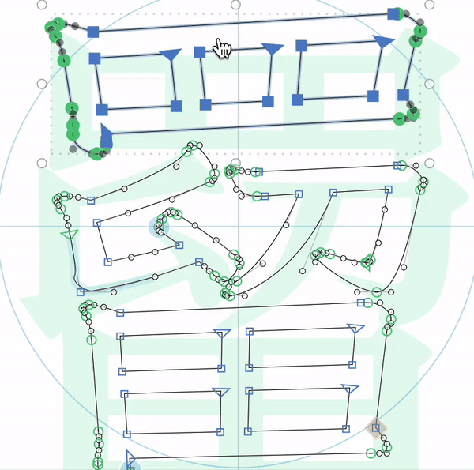

# Smart Select Tool | 智慧選取工具 | スマートセレクトツール

### English

Glyphs.app plug-in for selecting CJK paths more easiler and faster.
The hotkey is X.

### 繁體中文

這是一個 Glyphs 外掛程式，可加快選取漢字外框的速度。

由於漢字筆畫多，又容易交疊在一起，要選取部件時往往需要大量滑鼠連點，還很容易不小心選錯路徑，甚至手賤不小心移動到。這個選取工具可 ①點兩下直接選取整個外框 ②拖曳選擇範圍內控制點勾到邊的完整路徑 ，並支援 Shift 增減選取，呵護您的食指。

此選取工具的熱鍵是 Ｘ。

### 日本語

これは Glyphs のプラグインで、CJK文字のパスを楽々選択することができます。

漢字のパスを選択するとき、大変だと思うことがありますか。パスが大量にあるし、中抜けのある書き殴りなら内外も選択しなくてはなりません。大量にダブルクリックしなければならないので指の負担が大きくなります。
このセレクトツールは ①ダブルクリックでエレメント単位で選択 ②ドラッグ選択で範囲内のノードをアウトラインに拡大して丸ごと選択 することが可能。Shiftキーでの追加選択にも対応しますので、漢字の選択が劇的楽になります。

ホットキーはXです。

## Requirements

The plug-in works both in Glyphs 2 and Glyphs 3. I can only test it in latest app, and perhaps it crashs on earlier versions.

此外掛程式適用於 Glyphs 2 與 Glyphs 3，但只在目前最新版本測試過。

このプラグインは Glyphs 2 と Glyphs 3 に対応しています。ただし最新バージョンでしかテストしていません。

## License

Copyright 2022 But Ko (@buttaiwan).
Based on sample code by Georg Seifert (@schriftgestalt).

Licensed under the Apache License, Version 2.0 (the "License");
you may not use this file except in compliance with the License.
You may obtain a copy of the License at

http://www.apache.org/licenses/LICENSE-2.0

See the License file included in this repository for further details.
